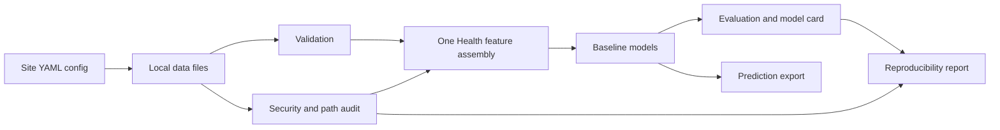

# Architecture

```mermaid
flowchart LR
    A["Site YAML config"] --> B["Local data files"]
    B --> C["Validation"]
    B --> D["Security and path audit"]
    C --> E["One Health feature assembly"]
    D --> E
    E --> F["Baseline models"]
    F --> G["Evaluation and model card"]
    F --> H["Prediction export"]
    G --> I["Reproducibility report"]
    D --> I
```

All core steps run on the local machine and write generated artifacts under project-local paths by default.
